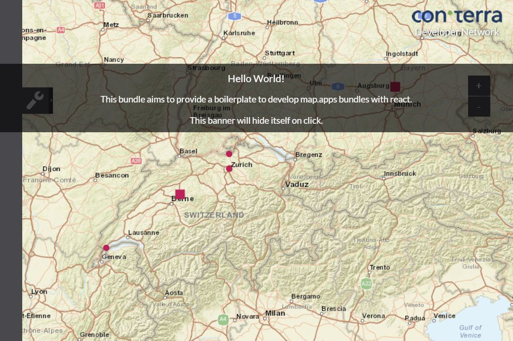

# map.apps Remote Project Blueprint - React Bundle

# React Bundle Development

1. change the map.apps remote base in __pom.xml__ and __build.properties__
1. follow the instructions in the ``bundles/rc_enhancer/README.md`` file.

## Suggestions

1. use nightmarejs to run e2e tests
1. use jspanel4 as alternative to the dojo windows

Development Guide
------------------
### Pre Conditions
This project requires an existing installation of map.apps to work. You need top copy the libs provided in the CD-Contents folder "m2repository" inside your local maven repository.

### Define the mapapps remote base
Before you can run the project you have to define the mapapps.remote.base property in the pom.xml-file:
`<mapapps.remote.base>http://%YOURSERVER%/ct-mapapps-webapp-%VERSION%</mapapps.remote.base>`

##### Other methods to to define the mapapps.remote.base property.
######1. Add a goal parameter
`mvn install -Dmapapps.remote.base=http://%YOURSERVER%/ct-mapapps-webapp-%VERSION%`

######2. Change the mapapps.remote.base property in the build.properties file and run:
`mvn install -Denv=dev -Dlocal.configfile=%ABSOLUTEPATHTOPROJECTROOT%/build.properties`

### Maven Goals

##### Start jetty at http://localhost:9090 for local implementation.
`mvn jetty:run`

##### build uncompressed jar and app template
`mvn install`

##### build uncompressed jar and app template and upload them to the remote map.apps installation
`mvn clean install -P upload`

##### build compressed jar and app template
`mvn clean install -P compress`

##### build compressed jar and app template and upload them to the remote map.apps installation
`mvn clean install -P compress,upload`

### URLs 
The following urls are available after maven goal `jetty:run` was executed.

##### Base App
http://localhost:9090

##### Embedded JS Registry
http://localhost:9090/resources/jsregistry/root

##### Open Tests in Browser
http://localhost:9090/js/tests/runTests.html
